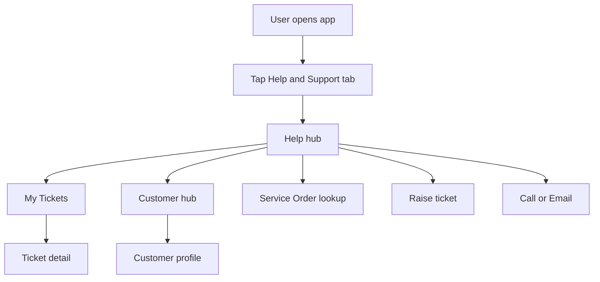
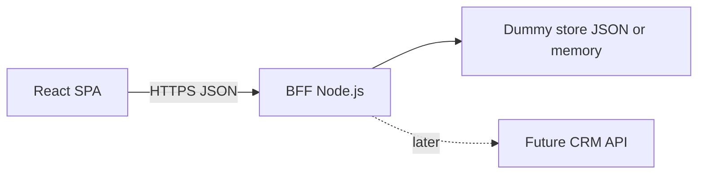

# Product Requirements Document

## 1. Overview

**Product / Feature Name:** JioMart Digital Business-to-Business (B2B) Retailer Portal — Help and Support Module (excluding Knowledge Base and Live Chat)

**Author:** Abhilash Asolkar, Senior Product Manager, JioMart Digital

**Date Created / Updated:** 2026-04-03 (Created)

**Status:** Draft

### Summary

This document defines requirements for the Help and Support area of the B2B retailer application. The goal is a clear module for tickets, customer care hub, service order (SO) status, phone and email contact, and contextual help flows. Knowledge Base, Frequently Asked Questions (FAQ), and Live Chat are out of scope. The intent is to give engineering a build path that does not break Home, Category, Orders, or My Business. Implementation starts as a front-end prototype with dummy data, then adds a Backend for Frontend (BFF) with dummy Application Programming Interface (API) contracts that can later be swapped for real Customer Relationship Management (CRM) services.

### Background

B2B retailers need a single place to track their own issues, manage end-customer service, and check installation or repair progress. Today the codebase includes a prototype with many screens. This Product Requirements Document (PRD) narrows the product scope for Help and Support and aligns routes, data, and APIs so developers can implement in phases without guesswork.

### Objective

Deliver a Help and Support experience that is easy to find, fast to use, and ready to connect to real backends later.

### Goals

List the key measurable objectives for this initiative.

- Increase share of care issues logged through the portal versus phone-only (target To Be Confirmed (TBC); measure after launch).
- Reduce time to find ticket status or service order status (target TBC seconds from Help hub entry; observe in usability tests or analytics).
- Keep regression rate at zero for core commerce tabs: Home, Category, Orders, My Business (binary: no broken navigation or layout in release testing).
- Achieve partner Customer Satisfaction (CSAT) for Help flows at or above target (baseline and target TBC; source TBC).

### Non-Goals

What is explicitly out of scope for this effort.

- Knowledge Base and article browsing.
- FAQ screen, search, accordion content, and any “See all” FAQ entry points from Help.
- Live Chat and bot experiences.
- Real CRM integration in Phase 1 and Phase 2 dummy API work (only contracts and stubs).
- Changes to core shopping, catalog, or order placement logic outside Help and Support.

### Assumptions

- Retailers are authenticated in production; prototype may use a fixed retailer identifier in headers or query for dummy APIs.
- Phone and email remain supported contact channels.
- The front-end stack stays Vite, TypeScript, React, Tailwind CSS, React Router, TanStack Query (React Query).
- BFF runs on Node.js (recommended: Express or Fastify) in a folder such as `bff/`, started in a second terminal or via a root script.
- Dummy APIs return stable JSON; optional delay or error simulation via query parameter (for example `?slow=1`) or header for demos.
- Key Performance Indicator (KPI) baselines will be filled when analytics and care operations share numbers; until then tables show TBC.

---

## 2. Problem Space

### 2.1 Problem Description

**Pain point:** Retailers juggle their own order and billing issues with end-customer installation and service. Without a focused Help module, they rely on calls and scattered tools. That slows resolution and hides status.

**Who is affected:** B2B retailer store owners and staff who use the JioMart Digital portal (partner segment).

**When and where:** After purchase, delivery, installation, refunds, and service visits. Issues show up on mobile-first portal usage during business hours.

**Why it matters now:** A scoped Help module reduces support load, improves transparency, and prepares the product for CRM integration without shipping Knowledge Base or Chat in this phase.

**Questions answered:**

- **What is the pain point?** Hard to see ticket and service order status in one place; self-service is incomplete without a defined module.
- **Who experiences it?** B2B retailer users and indirectly partner care teams.
- **When and where does it occur?** During post-order care and service tracking inside the portal.
- **Why does it matter now?** Aligns prototype to a clear roadmap and avoids scope creep into FAQ or Chat.

### 2.2 Supporting Metrics

Quantitative indicators that highlight the problem. **Stakeholder data requested:** see Section 8 and the “Data requested from stakeholders” table at the end of this document.

| Metric | Current Value | Desired Value | Observation Period | Source |
|--------|---------------|---------------|-------------------|--------|
| Share of care touches via portal vs phone | TBC | TBC | TBC | TBC (analytics / care ops) |
| Median time to view ticket status from app open | TBC | TBC | TBC | TBC (session replay / lab) |
| Partner CSAT for care | TBC | TBC | Last 30 days rolling | TBC (survey / CRM) |
| Tickets created with complete category data | TBC | TBC | TBC | TBC (CRM export) |

---

## 3. Solution Space

### 3.1 Proposed Solution (High-Level)

Introduce a dedicated Help and Support hub with in-scope actions only: My Tickets, Customer hub, Service Order lookup, raise ticket flows, call and email, and contextual complaint or installation help. Remove or hide Knowledge Base, FAQ, and Chat from this module’s user interface. Keep Home, Category, Orders, and My Business behavior unchanged. Use mock data first, then a BFF that exposes dummy REST-style JSON APIs matching the shapes already modeled in code.

### 3.2 Expected Impact

| Metric | Baseline | Target | Measurement Window |
|--------|----------|--------|-------------------|
| Portal share of ticket creation | TBC | TBC | 1 month post-launch |
| Time to ticket status view | TBC | TBC | 1 month post-launch |
| CSAT for Help flows | TBC | TBC | 1 month post-launch |

### 3.3 Key Hypotheses

- If retailers can see ticket and service order status in the portal, call volume for status checks will fall (magnitude TBC).
- If raise-ticket flows stay short and clear, form abandonment will stay below target (TBC).
- If core tabs stay untouched, release risk for commerce flows stays low.

---

## 4. User Stories — High-Level List

| # | User Story | Slice / Milestone | Priority | Acceptance Criteria (summary) |
|---|------------|-------------------|----------|--------------------------------|
| 1 | As a retailer, I want Help and Support from the tab and menu without breaking other tabs, so I can trust navigation. | Slice 1 — Shell | P0 | Home, Category, Orders, My Business unchanged; Help tab highlights for Help routes only. |
| 2 | As a retailer, I want the Help hub to show only in-scope actions, so I am not sent to FAQ or Chat. | Slice 1 — Hub | P0 | No Knowledge Base tile, no Chat tile, no FAQ list or “See all” to `/faq`; no primary call-to-action to `/chat`. |
| 3 | As a retailer, I want to list and filter my own tickets and open details, so I can track my issues. | Slice 2 — My tickets | P0 | List, filters, detail with timeline. |
| 4 | As a retailer, I want a customer hub and profile, so I can manage end-customer tickets. | Slice 2 — Customer hub | P0 | Search or list customers; profile shows purchases and tickets. |
| 5 | As a retailer, I want to raise tickets for self and for customers with a clear wizard, so data is complete. | Slice 2 — Create | P0 | Category steps, validation, confirmation. |
| 6 | As a retailer, I want Service Order lookup by SO number or mobile, so I see live-style status. | Slice 2 — SO lookup | P1 | Route `/service/lookup` renders Service Order Lookup screen; progress states visible. |
| 7 | As a developer, I want dummy APIs via BFF, so the UI can switch from mock imports to HTTP with minimal change. | Slice 3 — BFF | P1 | Endpoints match Part B contracts; types align with `mockData.ts`. |

---

## 5. User Story Details

### Story ID: 1

**Title:** Help and Support entry without breaking core tabs

**Given / When / Then:**

- Given I am on any main tab,
- When I tap Help and Support or open Support from the sidebar,
- Then I reach the Help hub and other tabs still route correctly.

**Edge Cases / Notes:**

- HashRouter base path `/B2B-Care-automation/` must be respected in links (already configured in Vite `base`).

**Dependencies:**

- `AppLayout.tsx` bottom tabs and `isTabActive` logic.

**Implementation notes:** File: `src/components/AppLayout.tsx`. Do not remove Help tab; ensure active state covers `/help`, `/service/*`, `/ticket/*` only for Help highlight, not Orders paths.

---

### Story ID: 2

**Title:** Help hub shows only in-scope actions

**Given / When / Then:**

- Given I open Help hub,
- When I scan quick actions and secondary sections,
- Then I do not see Knowledge Base, Chat, FAQ shortcuts, or links to `/faq` or `/chat` as primary module actions.

**Edge Cases / Notes:**

- “Still need help?” may remain as **Call Us** (telephone) only; do not add Chat.
- Deep routes `/faq` and `/chat` may exist in the app for legacy builds; product does not promote them from Help.

**Dependencies:**

- `HelpCenterPage.tsx` quick action list and FAQ block removal or replacement.

**Implementation notes:** File: `src/pages/HelpCenterPage.tsx`. Remove or feature-flag entries for Knowledge Base and Chat; remove “Frequently Asked” block and “See all” to FAQ, or replace with in-scope content (for example link to Raise ticket).

---

### Story ID: 3

**Title:** My tickets list, filters, and detail

**Given / When / Then:**

- Given I have self-type tickets,
- When I open My Tickets and apply status filters,
- Then I see the right subset and can open a ticket detail page.

**Edge Cases / Notes:**

- Empty state when no tickets.
- Ticket identifiers such as `TKT-S-001` must resolve in detail route.

**Dependencies:**

- `SelfDashboardPage.tsx`, `TicketDetailPage.tsx`, data source.

**Implementation notes:** Routes: `/service/self`, `/ticket/:ticketId`. Data today: `mockSelfTickets` in `src/lib/mockData.ts`.

---

### Story ID: 4

**Title:** Customer hub and customer profile

**Given / When / Then:**

- Given I serve end customers,
- When I open the customer hub and select a customer,
- Then I see profile, purchases, and related tickets.

**Edge Cases / Notes:**

- Search by mobile or serial where the UI supports it.

**Dependencies:**

- `CustomerDashboardPage.tsx`, `CustomerProfilePage.tsx`, `mockCustomers`.

**Implementation notes:** Routes: `/service/customer`, `/service/customer/:customerId`.

---

### Story ID: 5

**Title:** Raise ticket for self and for customer

**Given / When / Then:**

- Given I start create ticket,
- When I complete category, details, and review steps,
- Then I see confirmation and a new or updated ticket reference.

**Edge Cases / Notes:**

- Different category trees for `self` vs `customer` per `ticketCategories` in `mockData.ts`.

**Dependencies:**

- `CreateTicketPage.tsx`, optional `SmartCreateTicketPage.tsx`.

**Implementation notes:** Routes: `/service/self/create`, `/service/customer/create`, `/ticket/create`.

---

### Story ID: 6

**Title:** Service Order lookup screen on correct route

**Given / When / Then:**

- Given I need service order status,
- When I navigate to Service Order lookup from Help or deep link `/service/lookup`,
- Then I see `ServiceOrderLookupPage` (search by SO number or mobile, progress display).

**Edge Cases / Notes:**

- **Code gap:** In `App.tsx`, `/service/lookup` currently renders `CustomerDashboardPage`. Developer must change to `ServiceOrderLookupPage` and add import.

**Dependencies:**

- `ServiceOrderLookupPage.tsx`, `mockOrders` and nested `serviceOrder` on items.

**Implementation notes:** File: `src/pages/ServiceOrderLookupPage.tsx` (exists but not wired to route).

---

### Story ID: 7

**Title:** BFF dummy APIs

**Given / When / Then:**

- Given the BFF is running,
- When the front-end calls documented endpoints with optional `X-Retailer-Id` (or query `retailerId`),
- Then JSON responses match Part B schemas.

**Edge Cases / Notes:**

- CORS: allow local Vite origin in development.

**Dependencies:**

- New `bff/` package or folder; front-end `fetch` or React Query.

**Implementation notes:** See Part B.

---

## 6. User Experience (UX) / User Interface (UI) Design

**Links to designs or prototypes:**

- Live prototype (current build): `https://rilabhilashasolkar.github.io/B2B-Care-automation/` (GitHub Pages; path includes app `base`).
- Figma / Miro: TBC (insert URL when available).

**Key flows or screens:**

- Help hub → My Tickets → Ticket detail.
- Help hub → Customer hub → Customer profile.
- Help hub → Raise ticket wizard (self or customer).
- Help hub → Service Order lookup (after route fix).
- Help hub → Call Us / Email Us (external `tel:` and `mailto:`).
- Contextual: `/help/complaint`, `/help/installation` as needed for campaigns.

**Note on README:** The repository `README.md` still lists FAQ and Live Chat among screens. For Help and Support scope, treat this PRD as the source of truth; update README in a small follow-up pull request to avoid conflicting claims.

---

## 7. Technical Considerations

### Tech Stack

- Front-end: React, TypeScript, Vite, Tailwind CSS, React Router, TanStack React Query.
- BFF: Node.js with Express or Fastify (team choice).
- Data: Phase A — in-memory / JSON in BFF; Phase B — replace handlers with CRM HTTP clients.

### Integration Points (future)

- CRM (for example Kapture) for tickets and service orders.
- Analytics SDK or tag manager for events in Section 7.5.

### Data Model (conceptual)

Align with TypeScript interfaces in `src/lib/mockData.ts`: `Ticket`, `TicketEvent`, `Customer`, `CustomerPurchase`, `Order`, `OrderItem`, `ServiceOrder`, `ServiceOrderStatus`, category trees under `ticketCategories`.

### 7.1 Detailed Functional Requirements

1. Help hub displays only in-scope quick actions after Story 2.
2. My Tickets: list self tickets with status filter; tap opens detail.
3. Ticket detail: show timeline if present; show status and priority.
4. Customer hub: list or search customers; navigate to profile.
5. Customer profile: purchases and tickets for that customer.
6. Create ticket: multi-step flow with category, subcategory, optional sub-subcategory, description, review.
7. Service Order lookup: search by SO id substring or customer mobile; show status steps.
8. Phone and email: use `tel:` and `mailto:` links with published numbers and mailbox.
9. Optional: contextual Help Complaint and Help Installation pages remain available at `/help/complaint` and `/help/installation`.

### 7.2 Detailed Non-Functional Requirements

1. **Performance:** Help hub first meaningful paint under TBC seconds on mid-tier mobile (set target in test plan).
2. **Reliability:** If BFF fails, show user-visible error and retry; do not white-screen.
3. **Security:** BFF must not log full mobile numbers in plain text in production; use masking rules TBC.
4. **Accessibility:** Tap targets and headings follow existing app patterns; target Web Content Accessibility Guidelines (WCAG) 2.1 Level AA where feasible.
5. **Compatibility:** Same browsers as main portal TBC.

### 7.3 Logical Flow



### 7.4 System Design (High-Level)



The Browser sends requests to the BFF. The BFF returns dummy data first. Later the BFF maps the same routes to CRM.

### 7.5 Data and Analytics

**Suggested event names** (instrument when analytics stack is chosen):

| Event name | When | Properties (examples) |
|------------|------|------------------------|
| `help_hub_view` | Help hub mount | `retailer_id_hash`, `entry` tab or sidebar |
| `help_quick_action_tap` | Tap tile | `action_key` my_tickets, customer_hub, so_lookup, call, email |
| `ticket_list_view` | Self dashboard mount | `filter_status` |
| `ticket_open` | Open detail | `ticket_id`, `type` self or customer |
| `ticket_create_submit` | Successful create | `category`, `subcategory`, `type` |
| `so_lookup_search` | Search submit | `search_type` so or mobile, `result_count` |

**Dashboard tool:** TBC (for example Google Analytics 4, Mixpanel, or internal lake).

---

## 8. Success Metrics

| Metric | Target | Source | Frequency |
|--------|--------|--------|-----------|
| Portal ticket creation share | TBC | CRM plus web analytics | Weekly |
| Median time to ticket status | TBC | Analytics / lab | Monthly |
| CSAT for Help flows | TBC | Survey | Monthly |
| Regression bugs on core tabs | 0 P0 | Quality assurance | Per release |

---

## 9. Risks and Dependencies

- **CRM contract drift:** Dummy API fields may not match final CRM; mitigate with versioned API (`/api/v1`) and change log.
- **Scope creep:** Pressure to add FAQ or Chat; mitigate with explicit non-goals and change control.
- **Duplicate entry points:** Sidebar “Support” and bottom tab both go to Help; keep paths consistent.
- **Legal and compliance:** Published phone and email must match official partner communications.
- **Dependency:** Design final sign-off for hub tile layout after FAQ removal.

---

## 10. Timeline and Milestones

| Milestone | Description | Owner | Target Date | Status |
|-----------|-------------|-------|-------------|--------|
| PRD draft | This document | Product | 2026-04-03 | Complete |
| PRD review | Engineering and design | Product | TBC | Pending |
| Slice 1 | Hub and shell cleanup | Front-end | TBC | Pending |
| Slice 2 | Routes, SO lookup wire, polish | Front-end | TBC | Pending |
| Slice 3 | BFF and client integration | Full stack | TBC | Pending |
| Pilot | Internal retailers | Product | TBC | Planned |

---

## 11. Open Questions and Next Steps

- **Bookmarks:** Should `/faq` and `/chat` redirect to `/help` with a message, return 404 in product, or stay hidden-only? Decision: TBC.
- **Service Order lookup:** Confirm ownership copy and escalation path when status is stuck.
- **Analytics:** Which tool and event schema owner?
- **Retailer identity:** Final header name for BFF auth (`Authorization` Bearer vs `X-Retailer-Id`).

**Next steps:** Review PRD, fill TBC metrics with care and analytics, align Figma, implement Slice 1 per Part B checklist.

---

## 12. References

- Code: `jmd-b2b-care/` React application.
- Data shapes: `src/lib/mockData.ts`.
- Routing: `src/App.tsx`.
- Shell: `src/components/AppLayout.tsx`.
- Prototype URL: `https://rilabhilashasolkar.github.io/B2B-Care-automation/`

---

# Part B — Developer Appendix (Plug-and-Play)

This section maps stories to files, route fixes, and dummy API contracts. **Base URL (development):** `http://localhost:4000/api/v1`. **Prefix all paths below with that base.** Use `Content-Type: application/json`.

## B.1 Code Map (Ground Truth)

| Area | File path |
|------|-----------|
| Routes | `src/App.tsx` |
| Bottom tab and Help active state | `src/components/AppLayout.tsx` |
| Help hub | `src/pages/HelpCenterPage.tsx` |
| My Tickets | `src/pages/SelfDashboardPage.tsx` |
| Customer hub | `src/pages/CustomerDashboardPage.tsx` |
| Customer profile | `src/pages/CustomerProfilePage.tsx` |
| Ticket detail | `src/pages/TicketDetailPage.tsx` |
| Create ticket | `src/pages/CreateTicketPage.tsx`, `src/pages/SmartCreateTicketPage.tsx` |
| Service Order lookup | `src/pages/ServiceOrderLookupPage.tsx` |
| Help contextual | `src/pages/HelpComplaintPage.tsx`, `src/pages/HelpInstallationPage.tsx` |
| Mock data and types | `src/lib/mockData.ts` |
| Out of scope (do not extend for this PRD) | `src/pages/FaqPage.tsx`, `src/pages/LiveChatPage.tsx` |

**Required route fix (Story 6):**

```tsx
// In App.tsx: import ServiceOrderLookupPage and replace the lookup route:
// <Route path="/service/lookup" element={<ServiceOrderLookupPage />} />
```

## B.2 Shared Types (mirror `mockData.ts`)

Developers can copy these to `src/lib/apiTypes.ts` or import from a shared package once the BFF owns schemas.

```typescript
// Abbreviations in comments: SO = Service Order, TKT = Ticket
export type TicketStatus =
  | "Open" | "In Progress" | "Awaiting Info" | "Resolved" | "Closed" | "Reopened";
export type TicketPriority = "High" | "Medium" | "Low";
export type ServiceOrderStatus =
  | "Open" | "Engineer Visit Pending" | "Engineer On the Way" | "Closed";

export interface TicketEventDTO {
  id: string;
  type: "created" | "updated" | "comment" | "status_change" | "assigned";
  description: string;
  timestamp: string;
  actor: string;
}

export interface TicketDTO {
  id: string;
  type: "self" | "customer";
  category: string;
  subcategory: string;
  subSubcategory?: string;
  status: TicketStatus;
  priority: TicketPriority;
  description: string;
  createdAt: string;
  updatedAt: string;
  orderId?: string;
  customerName?: string;
  customerMobile?: string;
  productName?: string;
  serialNumber?: string;
  assignedTo?: string;
  attachments?: string[];
  timeline?: TicketEventDTO[];
}

export interface CustomerPurchaseDTO {
  id: string;
  orderId: string;
  productName: string;
  serialNumber: string;
  purchaseDate: string;
  warrantyExpiry: string;
  warrantyStatus: "Active" | "Expired" | "Extended";
  installationDate?: string;
  installationStatus: "Pending" | "Completed" | "Not Required";
}

export interface CustomerDTO {
  id: string;
  name: string;
  mobile: string;
  email?: string;
  address: string;
  city: string;
  pincode: string;
  purchases: CustomerPurchaseDTO[];
  tickets: TicketDTO[];
  createdAt: string;
}

export interface ServiceOrderDTO {
  id: string;
  itemId: string;
  customerMobile: string;
  status: ServiceOrderStatus;
  createdAt: string;
  updatedAt: string;
}

export interface ServiceOrderLookupResultDTO {
  serviceOrder: ServiceOrderDTO;
  itemName: string;
  orderId: string;
  sku: string;
  serialNumber: string;
}
```

## B.3 Fetch Helper (Front-End)

```typescript
const API_BASE = import.meta.env.VITE_BFF_BASE ?? "http://localhost:4000/api/v1";

export async function apiGet<T>(path: string, init?: RequestInit): Promise<T> {
  const res = await fetch(`${API_BASE}${path}`, {
    ...init,
    headers: { Accept: "application/json", ...init?.headers },
  });
  if (!res.ok) throw new Error(`${res.status} ${res.statusText}`);
  return res.json() as Promise<T>;
}

export async function apiPost<TBody, TRes>(path: string, body: TBody): Promise<TRes> {
  const res = await fetch(`${API_BASE}${path}`, {
    method: "POST",
    headers: { "Content-Type": "application/json", Accept: "application/json" },
    body: JSON.stringify(body),
  });
  if (!res.ok) throw new Error(`${res.status} ${res.statusText}`);
  return res.json() as Promise<TRes>;
}
```

Add to Vite env: `VITE_BFF_BASE=http://localhost:4000/api/v1` in `.env.development` (create if allowed by team policy).

## B.4 Dummy API Contracts

### GET `/tickets/self`

**Query:** `status` optional — filter by `TicketStatus`.

**Response 200:**

```json
{ "tickets": [ { "...": "TicketDTO" } ] }
```

### GET `/tickets/self/:ticketId`

**Response 200:** `TicketDTO`  
**Response 404:** `{ "error": "not_found" }`

### GET `/tickets/customer`

**Response 200:**

```json
{ "tickets": [ { "...": "TicketDTO" } ] }
```

### GET `/customers`

**Response 200:**

```json
{ "customers": [ { "...": "CustomerDTO" } ] }
```

### GET `/customers/:customerId`

**Response 200:** `CustomerDTO`  
**Response 404:** `{ "error": "not_found" }`

### POST `/tickets`

**Body:**

```json
{
  "type": "self",
  "category": "Order Issues",
  "subcategory": "Damaged Product",
  "subSubcategory": "Transit Damage",
  "description": "text",
  "orderId": "optional",
  "customerName": "optional when type customer",
  "customerMobile": "optional",
  "productName": "optional",
  "serialNumber": "optional"
}
```

**Response 201:**

```json
{ "ticket": { "...": "TicketDTO with new id" } }
```

### GET `/service-orders/search`

**Query:** `q` (string, required), `mode` = `so` | `mobile` (required).

**Response 200:**

```json
{ "results": [ { "...": "ServiceOrderLookupResultDTO" } ] }
```

### GET `/meta/ticket-categories`

**Response 200:** Same shape as `ticketCategories` in `mockData.ts` (self and customer trees).

## B.5 Example BFF Handler (Express, sketch)

```javascript
// Illustrative only — place in bff/src/index.js or use TypeScript equivalent
import express from "express";
import { mockSelfTickets, mockCustomerTickets, mockCustomers, mockOrders } from "./seed.js"; // copy from mockData or generate

const app = express();
app.use(express.json());

app.get("/api/v1/tickets/self", (req, res) => {
  let list = mockSelfTickets;
  const { status } = req.query;
  if (status) list = list.filter((t) => t.status === status);
  res.json({ tickets: list });
});

app.get("/api/v1/tickets/self/:ticketId", (req, res) => {
  const t = mockSelfTickets.find((x) => x.id === req.params.ticketId);
  if (!t) return res.status(404).json({ error: "not_found" });
  res.json(t);
});

// ... mirror remaining routes from B.4

app.listen(4000, () => console.log("BFF on :4000"));
```

Seed data can be a one-time export of arrays from `mockData.ts` to `bff/seed.json` to avoid circular imports.

## B.6 React Query Example (My Tickets)

```typescript
import { useQuery } from "@tanstack/react-query";
import { apiGet } from "../lib/apiClient";
import type { TicketDTO } from "../lib/apiTypes";

export function useSelfTickets(status?: string) {
  return useQuery({
    queryKey: ["tickets", "self", status],
    queryFn: () => {
      const q = status ? `?status=${encodeURIComponent(status)}` : "";
      return apiGet<{ tickets: TicketDTO[] }>(`/tickets/self${q}`);
    },
  });
}
```

Replace local `mockSelfTickets` usage in `SelfDashboardPage.tsx` with `useSelfTickets` when Slice 3 is active. Until then, keep mock imports for Phase A.

---

## Data Requested from Stakeholders

Please return filled values so Sections 2.2, 3.2, and 8 can move from TBC to real targets.

| Data item | Why it is needed | Your value |
|-----------|------------------|------------|
| Monthly active B2B retailers | Scale context | TBC |
| Share of sessions touching Help | Baseline usage | TBC |
| Monthly ticket volume (partner care) | Load planning | TBC |
| Median first response time | Success metric | TBC |
| CSAT or NPS for partner care | Success metric | TBC |
| First contact resolution rate | Quality metric | TBC |
| Deflection rate (if measured) | Self-service impact | TBC |

---

*End of Product Requirements Document*
